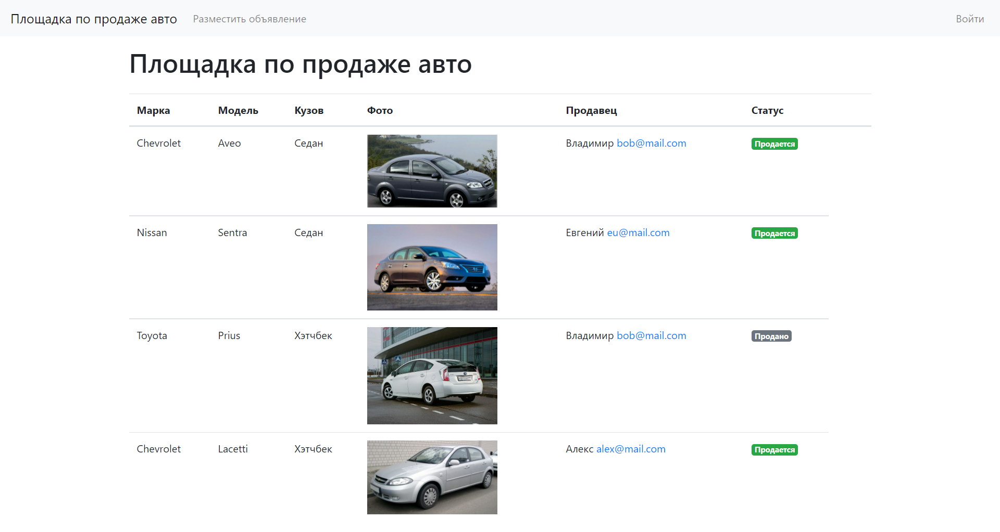
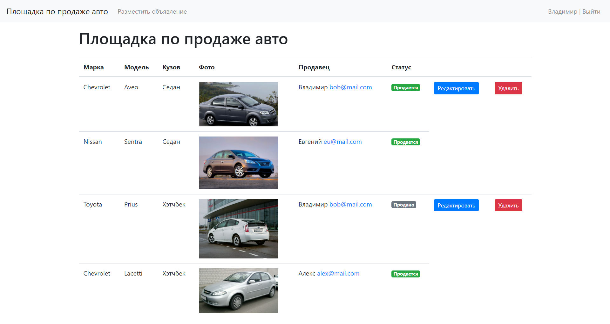
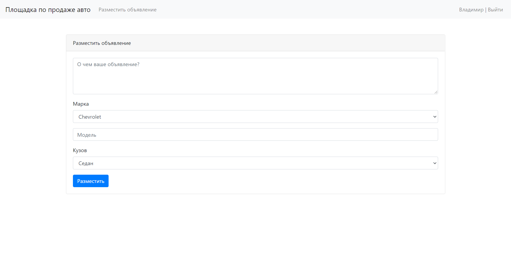
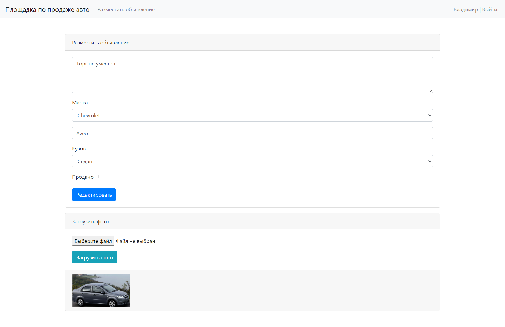
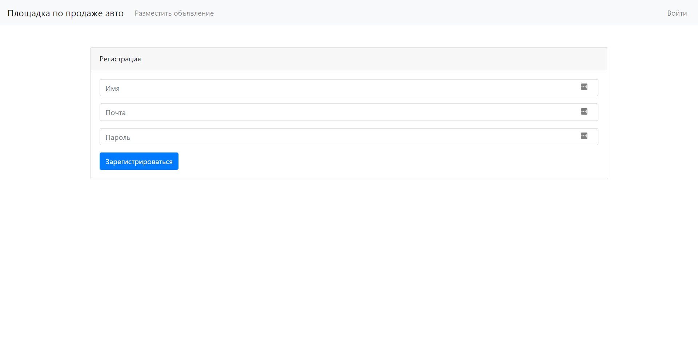
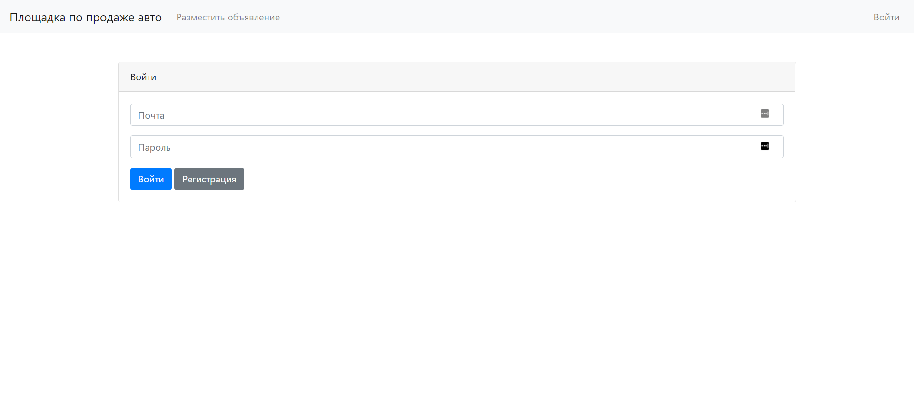

# job4j_cars

Учебный мини-проект в рамках курса [job4j](https://job4j.ru/)  
Технологии: Java 15, Servlets, JSP, JSTL, Postgres, Bootstrap 4
Реализованные возможности:
- Регистрация пользователя
- Создание/редактирование/удаление объявления
- Загрузка файлов на сервер

